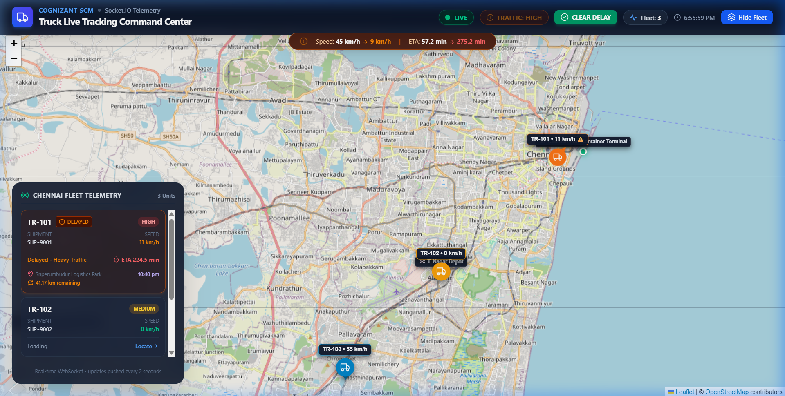
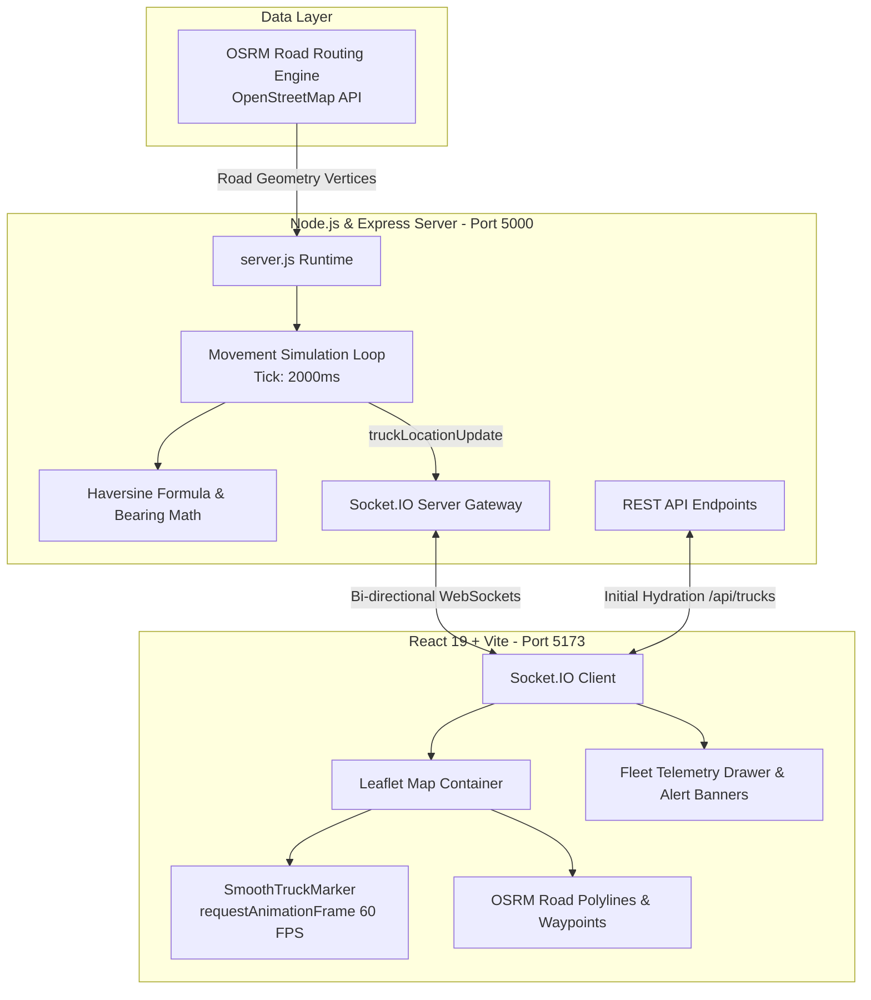

# 🚛 Cognizant SCM — Real-Time Truck Live Tracking & Disruption Command Center

[](https://react.dev/)
[](https://vitejs.dev/)
[](https://nodejs.org/)
[](https://expressjs.com/)
[](https://socket.io/)
[](https://leafletjs.com/)
[](https://tailwindcss.com/)
[](https://project-osrm.org/)

An enterprise-grade Supply Chain Management (SCM) telemetry platform designed for **Cognizant**, delivering millisecond-precision fleet tracking, road-accurate route navigation, dynamic delivery ETA intelligence, and automated appointment disruption mitigation.

---

## 📸 Command Center Dashboard Preview



*Real-time Fleet Command Center displaying OSRM road paths, directional vehicle headings, active traffic disruption alerts, and ETA comparison intelligence.*

---

## 🌟 Key Features

### 1. 🛣️ Real Road-Snapped Movement (OSRM & OpenStreetMap)
- Eliminates unrealistic straight-line GPS jumps by querying the **Open Source Routing Machine (OSRM)** on startup.
- Ingests hundreds of road-geometry vertices along major industrial freight corridors (e.g., Chennai Port Container Terminal ⇄ Sriperumbudur Logistics Park).
- Vehicles advance continuously along physical road polylines using **Speed → Distance/Time → Segment Interpolation**.

### 2. 🎯 Coordinate Stability at All Zoom Levels (Zero-Drift Architecture)
- **Mathematical Anchor Normalization**: Vehicle circular badges are anchored with exact geometric parity (`[20, 20]` on a 40×40 box), ensuring zero pixel-displacement whether viewed at regional zoom (level 2) or street-level zoom (level 19).
- **CSS Deconfliction**: Eliminated CSS transform transitions on Leaflet marker layers, allowing Leaflet’s internal projection engine to maintain 100% spatial accuracy without floating, rubber-banding, or teleporting during mouse-wheel and pinch zooms.

### 3. 🧭 Smooth 60 FPS Gliding & Dynamic Road Heading
- **`SmoothTruckMarker` Component**: High-frequency coordinate interpolation driven by `requestAnimationFrame` and native Leaflet `marker.setLatLng()` ensures fluid movement between 2-second telemetry packets with **0% React re-render overhead**.
- **Bearing Calculation**: Computes instantaneous vector compass headings (`calculateBearing()`), rotating directional vehicle pointers along the road's curves and switchbacks.

### 4. ⚡ Intelligent Disruption Simulation & ETA Intelligence
- **One-Click Disruption Testing**: Dispatchers can trigger and clear realistic traffic bottlenecks (`simulateDelay` / `clearDelay`).
- **Dynamic Speed Crawl**: Drops vehicle speed from cruising velocity (~45 km/h) to congestion crawl (8–12 km/h).
- **Dual-State ETA Differential**: Displays live before-and-after ETA comparisons (`Original ETA` vs `Delayed ETA`).
- **`APPOINTMENT_RISK` Guard**: Automatically evaluates if a shipment's recalculated ETA breaches its guaranteed appointment window and raises a critical alert banner.

### 5. 🎛️ Enterprise UI & Fleet Command Drawer
- **Dark Mode Glassmorphism**: Designed with Tailwind CSS 4 and Lucide enterprise icons for low eye fatigue in 24/7 monitoring centers.
- **Collapsible Telemetry Drawer**: Live inspection cards with priority badges (`High`, `Medium`, `Low`), shipment IDs, trailer numbers, coordinates, and remaining distance.
- **"Locate" Quick-Camera**: Instant camera fly-to centering on any selected freight asset.

---

## 🏗️ System Architecture



---

## 🛠️ Technology Stack

| Layer | Technology | Purpose |
| :--- | :--- | :--- |
| **Frontend Framework** | React 19.2 + Vite 8.3 | High-speed, modern reactive user interface |
| **Styling** | Tailwind CSS 4.3 + Vanilla CSS | Enterprise dark theme, glassmorphism, responsive cards |
| **Mapping Library** | Leaflet 1.9 + React-Leaflet 5.0 | High-performance interactive geospatial rendering |
| **Icons** | Lucide React | Clean, modern iconography for freight metrics |
| **Backend Runtime** | Node.js (v18+) + Express 4.19 | REST API and real-time state orchestration |
| **Real-time Protocol**| Socket.IO 4.8 | Low-latency full-duplex WebSocket communication |
| **Routing Engine** | OSRM (Open Source Routing Machine) | Turn-by-turn actual road geometry & routing |
| **Geodesic Math** | Haversine Formula + Great Circle Bearing | Exact metric distance & compass angle calculations |

---

## 📡 API & WebSocket Specification

### REST Endpoints

| Method | Endpoint | Description |
| :--- | :--- | :--- |
| `GET` | `/` | API health check |
| `GET` | `/api/trucks` | Returns all trucks with current telemetry, speeds, and ETAs |
| `GET` | `/api/trucks/:id` | Returns real-time status of a specific truck by ID |
| `GET` | `/api/routes` | Returns pre-computed OSRM road coordinates & depot points |

### Socket.IO Event Matrix

| Event Name | Direction | Payload Description |
| :--- | :--- | :--- |
| `truckLocationUpdate` | Server → Client | Emitted every 2s with updated `lat`, `lon`, `speed`, `bearing`, `etaMinutes`, `trafficStatus` |
| `routesData` | Server → Client | Emitted on connection with full GeoJSON-derived road coordinates for all trucks |
| `delayStatus` | Server → Client | Broadcasts disruption state with pre-delay and post-delay ETA comparisons |
| `appointmentRisk` | Server → Client | Triggered when `newArrival > appointmentEndTime` with delay impact analysis |
| `simulateDelay` | Client → Server | Requests congestion simulation for target `truckId` |
| `clearDelay` | Client → Server | Clears active delay and restores standard road speed |

---

## 🚀 Getting Started

### Prerequisites
- [Node.js](https://nodejs.org/) (version 18.0 or later recommended)
- `npm` (bundled with Node.js)

---

### Step 1: Clone & Install Dependencies

```powershell
# 1. Clone repository
git clone https://github.com/Tanish1431/Truck-Live-Status.git
cd Truck-Live-Status

# 2. Install backend dependencies (in root)
npm install

# 3. Install frontend dependencies
cd frontend
npm install
cd ..
```

---

### Step 2: Start the Backend Server

From the project root directory:

```powershell
# Run the backend server
node server.js
# Or
npm start
# Or
npm run dev
```

The server will automatically fetch OSRM road geometries from OpenStreetMap and listen on:
- **Backend API**: `http://localhost:5000`
- **Telemetry Endpoint**: `http://localhost:5000/api/trucks`
- **Route Coordinates**: `http://localhost:5000/api/routes`

---

### Step 3: Start the Frontend Application

Open a second terminal window in the `frontend` directory:

```powershell
cd frontend
npm run dev
```

Open your browser at:
👉 **`http://localhost:5173`**

---

## 🧪 Demo & Testing Walkthrough

1. **Verify Live Road Navigation**:
   - Observe **TR-101** traveling smoothly from *Chennai Port Container Terminal* along the highway toward *Sriperumbudur Logistics Park*.
   - Notice the directional pointer arrow aligning continuously with road bends.
2. **Test Zoom Stability**:
   - Scroll the mouse wheel to zoom in to street level (zoom 16) and zoom out to state view (zoom 9).
   - Observe that the truck marker **never drifts, jumps, or moves off its road position**.
3. **Trigger Traffic Congestion Simulation**:
   - Click the orange **"SIMULATE TRAFFIC DELAY"** button in the top navigation bar.
   - Watch the speed drop to ~9 km/h, the status switch to `Delayed - Heavy Traffic`, and the dual ETA banner display the schedule increase.
   - The **APPOINTMENT_RISK** alert appears if the arrival exceeds the delivery window.
4. **Restore Normal Conditions**:
   - Click **"CLEAR DELAY"** to instantly restore standard cruising speed and reset ETAs.

---

## 👥 Contributors & Acknowledgements

Developed for the **Cognizant Supply Chain Management (SCM) Hackathon**:
- **Author**: Tanish & Team
- **Repository**: [Tanish1431/Truck-Live-Status](https://github.com/Tanish1431/Truck-Live-Status)
- **Map Data**: © [OpenStreetMap](https://www.openstreetmap.org/copyright) contributors, routed via [OSRM](https://project-osrm.org/).
